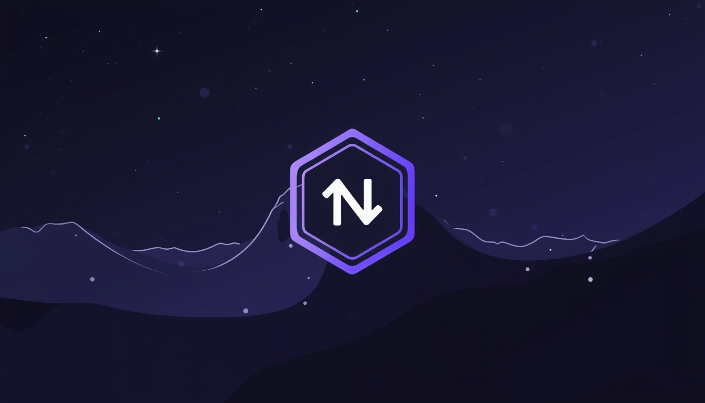

<p align="center">
  
</p>

# Notion Vault

A vibe-coded, self-hosted viewer for Notion workspace exports. Browse your exported Notion content with dark-mode aesthetics, full-text search, and a familiar navigation experience.

- **Image:** Gemini / Nano Banana
- **Code:** Claude Opus 4.5

## Features

- **Notion Dark Mode UI** — Pixel-perfect dark theme matching Notion's aesthetics
- **Full Navigation Tree** — Sidebar with expand/collapse, auto-expands to current page
- **Markdown Rendering** — Full GFM support with syntax-highlighted code blocks (Shiki)
- **Internal Link Resolution** — Links between pages work as SPA navigation
- **Full-Text Search** — Cmd+K search across all pages and CSV data (MiniSearch)
- **CSV Table Viewer** — View database exports with filtered/all variant toggle
- **Image Support** — Inline images and smart gallery for consecutive images
- **Breadcrumb Navigation** — Always know where you are in the hierarchy
- **Heading Anchors** — Deep-link to any section
- **Zero Database** — Everything runs from your static Notion export

## Getting Started

### 1. Export from Notion

1. Open your Notion workspace
2. Go to **Settings & Members** → **Settings** → **Export all workspace content**
3. Choose export format:
   - **Export format:** Markdown & CSV
   - **Include subpages:** Yes
   - **Include databases:** Everything
4. Download and extract the ZIP file

### 2. Set Up the Project

```bash
# Clone the repository
git clone https://github.com/your-username/notion-preview.git
cd notion-preview

# Install dependencies
bun install
# or: npm install / pnpm install / yarn

# Copy your Notion export to the data folder
cp -r /path/to/your/notion-export/* ./data/
```

Your `data/` folder should look like this:
```
data/
├── index.html          # Required: Navigation structure
├── Section Name/
│   ├── Page abc123.md
│   ├── Page/
│   │   ├── image.png
│   │   └── Subpage def456.md
│   └── Database xyz789.csv
└── Another Section/
    └── ...
```

### 3. Run the App

```bash
# Development
bun run dev

# Production build
bun run build
bun run start
```

Open [http://localhost:3000](http://localhost:3000) to browse your workspace.

## Configuration

Create or edit `notion-preview.config.js` in the project root:

```js
module.exports = {
  // Path to your Notion export folder
  dataPath: './data',

  // Theme (currently only dark is fully styled)
  theme: 'dark',

  // Default CSV view: 'all' or 'filtered'
  defaultCsvVariant: 'all',

  // Feature toggles
  features: {
    search: true,
    breadcrumbs: true,
    imageGallery: true,
    headingAnchors: true,
  },
}
```

## Tech Stack

- [Next.js 15](https://nextjs.org/) — React framework with App Router
- [React 19](https://react.dev/) — UI library
- [Tailwind CSS 4](https://tailwindcss.com/) — Styling
- [react-markdown](https://github.com/remarkjs/react-markdown) — Markdown rendering
- [Shiki](https://shiki.style/) — Syntax highlighting
- [MiniSearch](https://lucaong.github.io/minisearch/) — Full-text search
- [PapaParse](https://www.papaparse.com/) — CSV parsing

## Project Structure

```
src/
├── app/
│   ├── layout.tsx              # Root layout
│   ├── page.tsx                # Homepage
│   ├── page/[slug]/page.tsx    # Dynamic page route
│   └── api/                    # API routes
│       ├── nav/                # Navigation tree
│       ├── page/[id]/          # Page content
│       ├── csv/[id]/           # CSV data
│       ├── image/              # Image serving
│       └── search/             # Search endpoint
├── components/
│   ├── Sidebar/                # Navigation sidebar
│   ├── PageContent/            # Markdown renderer
│   ├── Table/                  # CSV table viewer
│   ├── SearchModal/            # Cmd+K search
│   ├── Breadcrumbs/            # Breadcrumb navigation
│   └── ImageGallery/           # Image lightbox
└── lib/
    ├── config.ts               # Configuration loader
    ├── parser/                 # File parsers
    └── search/                 # Search index
```

## Deployment

### Vercel / Netlify

1. Push your repository (without the `data/` folder)
2. Add your Notion export to the deployment or use a custom build step
3. Deploy as a standard Next.js application

> [!IMPORTANT]
> 
> If you deploy this app make sure you're not exposing any pages/content that's private. Clean it up or password-protect it.

### Self-Hosted

```bash
bun run build
bun run start
# or use PM2, Docker, etc.
```

## Limitations

- Notion's HTML export format can vary; some edge cases may not render perfectly
- Databases export as CSV only (no Notion database views)
- Real-time sync with Notion is not supported (it's a static export viewer)

## Contributing

Contributions are welcome! Please feel free to submit a Pull Request.

1. Fork the repository
2. Create your feature branch (`git checkout -b feature/amazing-feature`)
3. Commit your changes (`git commit -m 'Add amazing feature'`)
4. Push to the branch (`git push origin feature/amazing-feature`)
5. Open a Pull Request

## License

MIT License — feel free to use this for personal or commercial projects.

---

**Note:** This project is not affiliated with Notion. It's an independent tool for viewing Notion workspace exports.
